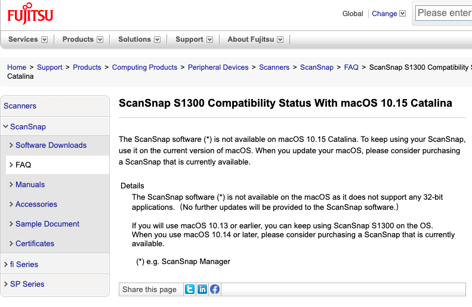

# Vagrantfile for bringing your old ScanSnap S1300 (not s1300i) back to life.

TL;DR: Fujitsu discontinued software support for Mac OS X. Starting with
OS X Catalina, ScanSnap Manager ceases to work on OS X. The Vagrantfile
in this repository automatically creates a environment that you can use
to continue scanning with your `Fujitsu ScanSnap S1300`!
**Don't buy a new scanner just because FUJITSU discontinued
their support for that product line**

A couple of days ago I went to my mailbox and fetched another
pile of letters, bills, and documents. I did what I'd usually do, that is
I threw them onto an ever growing pile of non-digitalized
documents just begging to be transferred into the matrix...

My conscience worsened as I saw that huge stack of paper. I had to do something...

Few days went past, before I finally had the courage to tacke
the issue.

I picked up my Fujitsu ScanSnap S1300 and hooked it up
to my computer, a MacBook Air which already had the
drivers and otherwise needed tools installed.

I fired up that ScanSnap Manager program in order to scan something,
but much to my bad surprise, I was greeted with a frienly message
including a big red cross saying "Sorry, you need to update ScanSnap Manager as it is not compatible on Catalina anymore".

OK!

Slightly swearing I started hacking some keywords into google
to get the requested update binaries....

Something was odd.

I could not find a driver package for S1300 anymore; only for S1300i (note the "i") was available.
I ignored the feelings of doubt emerging from my gut and continued
to install the software for S1300i. "Eh, it's just the same scanner with
some extras, that's why it only differs in the i", I thought. And further:
"It gotta work, the good folks from Fujitsu will have let all users
of that product line down, locking them to old versions of OS X!".

I was wrong. Sadly, this was exactly what had happened as following 
[webpage](https://www.fujitsu.com/global/support/products/computing/peripheral/scanners/scansnap/faq/s1300-catalina.html) 
and this screenshot

 

proves.

The feelings of doubt that had previously emerged from my gut
immediately turned into blind rage. I slammed shut my laptop
and went outside to vent my frustation by way of 10k running, but although
that might've been enough to release my anger, I could not find
the motivation to deal with that issue for another 3 weeks. 

Germany is in lock-down since the Coronavirus (COVID-19) is
currently shaking the world. With this repository 
I used some of my lock-in time productively
to solve the issue for all owners of a `Fujitsu ScanSnap S1300`.

**Don't buy a new scanner just because FUJITSU discontinued
their support for that product line**

**Don't let them win**

## Solution

- Clone this repository
- Open a Terminal and use `cd` to change into it.
- Run `./setup`
- Connect you Fujitsu ScanSnap S1300 via USB
- Run `vagrant ssh "scanimage -p --format=png > /vagrant/out.png"
- Thank me later
